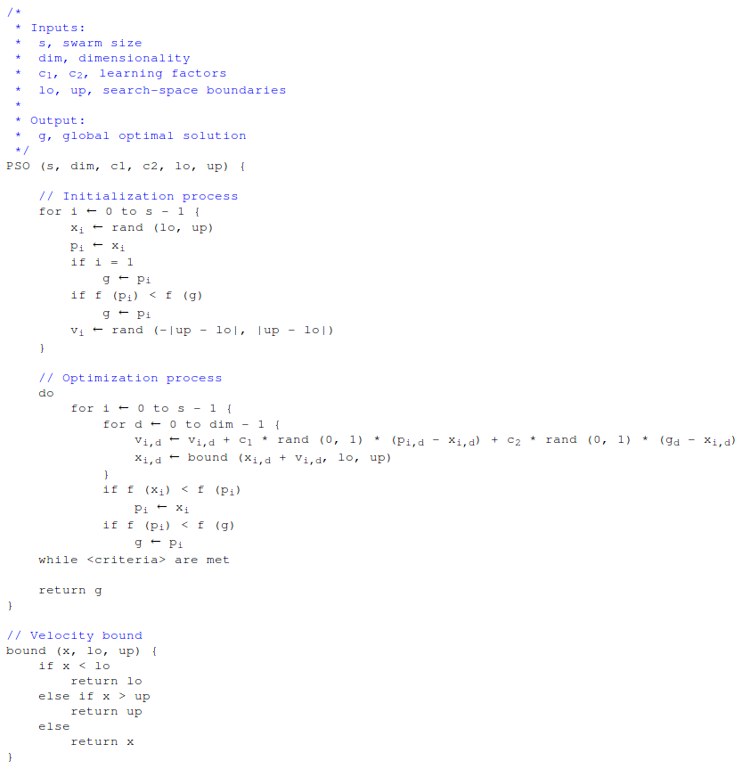
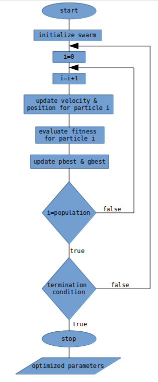
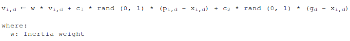
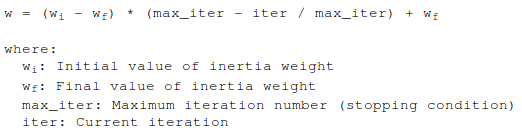
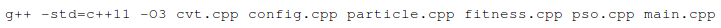

## Pseudocode

## Flowchart

## Inertia Weight

An inertia weight parameter can be introduced into the velocity equation to
improve performance and to balance the global and local search. The velocity 
equation then becomes:

Inertia weight can be constant or dynamic depending on the scheme being used. 
This program adjusts the inertia weight value at each iteration based on the 
following equation:

The PSO variation that implements the aforementioned idea is called **Linear 
Decreasing Inertia Weight PSO (LDIW-PSO)**.

## Stopping Criteria

The PSO iterates until it reaches a stopping criterion. The user can specify the 
stoping criterion of his/her choice. The available stopping criteria and their 
description are given below: 

1. **Maximum number of iterations**: The algorithm terminates when the number of 
iterations reaches a specified value.

2. **Stall generations**: The algorithm terminates when the number of stall 
generations reaches a specified value. In other words, when there is no 
immediate improvement after a specified number of iterations.

## Particle Initialization

The PSO performance is greatly affected by the starting positions of the 
particles. A common starting configuration is to randomly initialize each 
particle's position with a uniformly distributed random value. However, this 
configuration does not guarantee that the particles are evenly distributed 
throughout the search-space and is often the cause of variable performance. 

A more suitable starting configuration is based on centroidal Voronoi 
tessellations(CVT), and ensures that the particle's initial positions are more
evenly distributed throughout the search-space. 

For more details regarding, the calculation of the generator points for the 
approximate centroidal Voronoi tesselation please visit the dedicated 
[repository](https://github.com/PictureElement/Approximate-CVT).

## Objective Functions

Five well-known benchmark problems are used to test the PSO. The test functions 
are *Ackley*, *Griewank*, *Rastrigin*, *Rosenbrock*, and *De Jong's Sphere*. You 
can select which function to use in *fitness.cpp*. 

## Compilation

